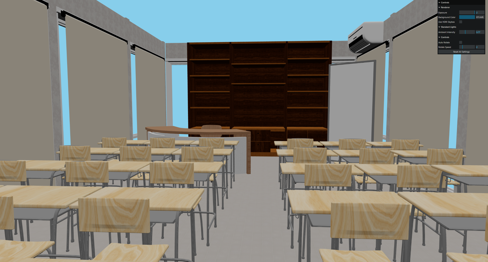
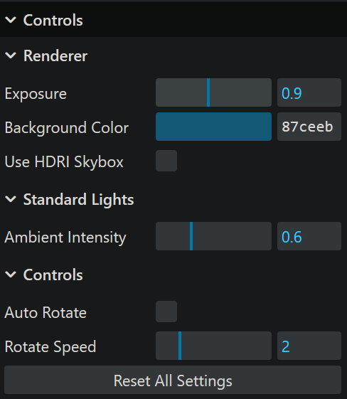
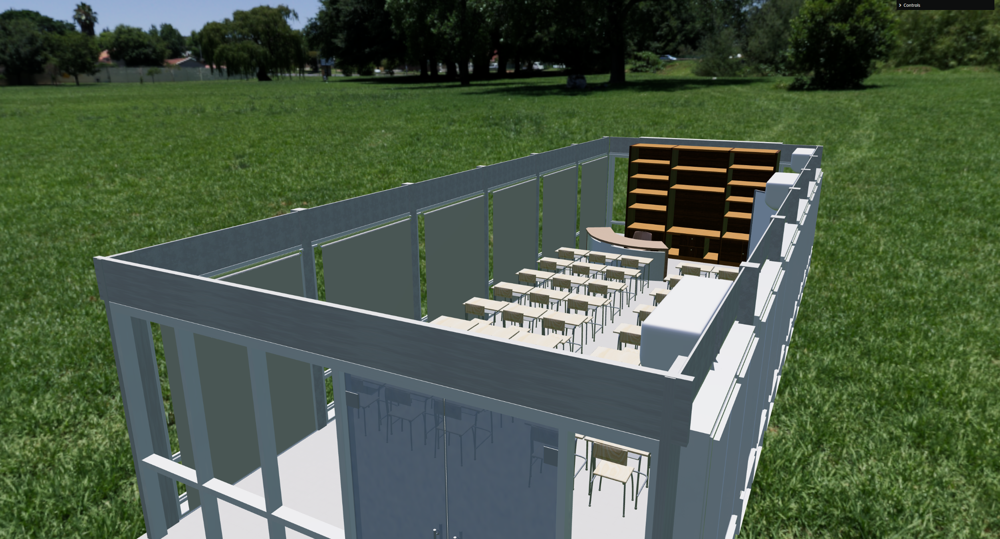

<div id="top">

<div align="center">

# FP-GRAFKOM-THREEJS

_"Hidden Gem" - Interactive 3D Room Exploration_


<br>

_Built with the tools and technologies:_

<p>
  
  
  
  
  
</p>

</div>

</div>

---

## Table of Contents
* [Teams](#teams)
* [Overview](#overview)
* [Features](#features)
* [Technologies Used](#technologies-used)
* [Project Structure](#project-structure)
* [Getting Started](#getting-started)
  * [Prerequisites](#prerequisites)
  * [Installation](#installation)
  * [Usage](#usage)
* [Asset Requirements](#asset-requirements)
* [How to Contribute](#how-to-contribute)
* [License](#license)

## Teams
1. Muhammad Rafly Abdillah - 5025231085
2. R. Rafif Aqil Aabid Hermawan - 5025231069
3. Fazle Robby Pratama - 5025231011
4. Muhammad Rizqy Hidayat - 5025231161
5. Reino Yuris Kusumanegara - 5025231075

---

## Overview

**FP-Grafkom-ThreeJS** is a Final Project for the Computer Graphics course. This web application renders an interactive 3D room ("Hidden Gem") using WebGL. The project demonstrates 3D object rendering capabilities, realistic lighting, and camera navigation within a browser environment.

It is designed to load external 3D models (`.glb`) and applies modern rendering techniques such as *Shadow Mapping* and *Tone Mapping* for aesthetic visual results.

## Screenshot







---

## Features

* 🎥 **Interactive Camera:** Uses `OrbitControls` to allow users to rotate, zoom, and pan around the room.
* 🏠 **3D Model Loading:** Integrates `GLTFLoader` to load complex room model assets from `.glb` format.
* 💡 **Realistic Lighting:**
  * Implementation of *Soft Shadows* (`PCFSoftShadowMap`).
  * *Tone Mapping* settings (`ACESFilmicToneMapping`) for color accuracy and light exposure.
  * Automatic handling of material properties (`castShadow`, `receiveShadow`, `DoubleSide`).
* ⚡ **Performance Optimized:** Uses Vite for super-fast hot-module replacement (HMR) during development.
* 📱 **Responsive Design:** The 3D Canvas automatically adjusts when the browser window is resized.

---

## Technologies Used

This project is built using the following modern web technologies:

* **Three.js** (v0.181.2) - Main library for 3D graphics rendering.
* **Vite** (v7.2.4) - Lightweight and fast build tool and development server.
* **JavaScript (ES6+)** - Interaction logic and scene initialization.
* **HTML5/CSS3** - Basic web page structure.

---

## Project Structure

The main folder structure in this repository:

```text
FP-Grafkom-ThreeJS/
├── public/
│   ├── models/
│   │   └── ruanganfix.glb  # (Main 3D Model File)
│   └── vite.svg
├── .gitignore              # Git ignore configuration
├── index.html              # Application entry point
├── main.js                 # Main Three.js logic (Scene, Camera, Renderer)
├── package.json            # List of dependencies and npm scripts
└── package-lock.json
```

# Getting Started

Follow these steps to run this project on your local machine.

## Prerequisites

* Node.js (Version 18+ recommended)
* npm (Built-in with Node.js)
* Modern Web Browser with WebGL support (Chrome, Firefox, Edge, Safari).

## Installation

1. Clone this repository:
```bash
git clone https://github.com/qyqystilllearning/FP-Grafkom-ThreeJS.git
```

2. Navigate to the project directory:
```bash
cd FP-Grafkom-ThreeJS
```

3. Install dependencies:
```bash
npm install
```

## Usage

1. Run the development server:
```bash
npm run dev
```

2. Open in browser: Usually access the local link shown in the terminal, for example: `http://localhost:5173`.

3. Build for production:
```bash
npm run build
```

## Asset Requirements

⚠️ **Important:**
The 3D model file is excluded from this repository due to its large size.

**You must download the asset manually for the app to work:**

1. 📥 **Download:** [**Click here to download ruanganfix.glb**](https://drive.google.com/file/d/1OGZqnMg5SLr5EgaedI_bKSWwsy6oT4Qq/view?usp=sharing) and [**the HDRI background**](https://drive.google.com/file/d/1JKWDm3x4Tnpn8qwfdQISYMHwRIkFqVvE/view?usp=sharing)
2. 📂 **Install:** Place the downloaded file into the `public/models/` folder.
   - Path: `public/models/ruanganfix.glb`

_Without this file, the application will load a blank gray scene._

## How to Contribute

Contributions are highly welcome! Please open an issue or pull request for bug fixes, new features, or code optimizations.

1. Fork this project.
2. Create a new feature branch (`git checkout -b cool-feature`).
3. Commit your changes (`git commit -m 'Add cool feature'`).
4. Push to the branch (`git push origin cool-feature`).
5. Create a Pull Request.

## Credits
- Desk and Chair : "School Desk and Chair" (https://skfb.ly/6xDtY) by T I A N is licensed under Creative Commons Attribution (http://creativecommons.org/licenses/by/4.0/).
- AC : "AC" (https://skfb.ly/o8YAv) by giga is licensed under Creative Commons Attribution (http://creativecommons.org/licenses/by/4.0/).
- Blinds : "Blind curtain" (https://skfb.ly/oUAtW) by Rotax125 is licensed under Creative Commons Attribution (http://creativecommons.org/licenses/by/4.0/).
- Whiteboard : "302 Whiteboard" (https://skfb.ly/6wpup) by Morgan is licensed under Creative Commons Attribution (http://creativecommons.org/licenses/by/4.0/).